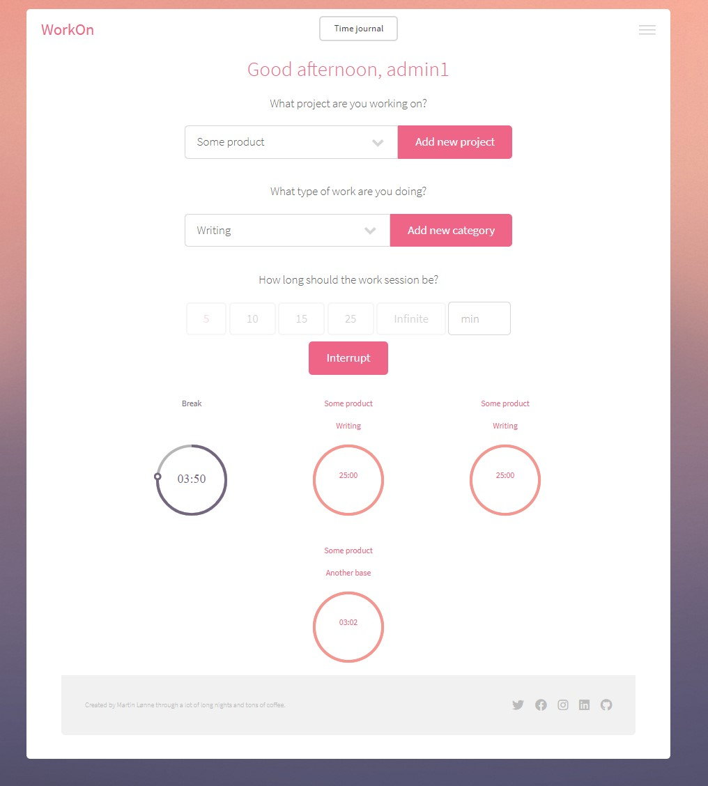
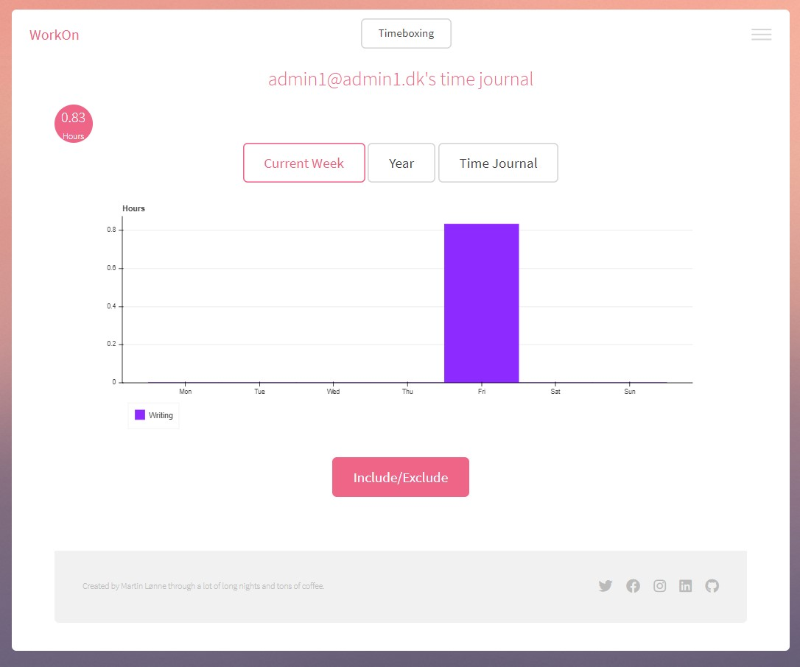

# Timeboxing and Statistics    ///  Frontend/Backend in Django w/ API

This is a old project, the first web app I ever did, and therefore also not updated or up-to standard, just uploaded it here to keep it somewhere :)
I had this deployed on a VPS server before, where it was used by me and my group during university to track time spent on projects and what we worked on. We could then track how much time was spent different categories.

## Timeboxing Frontend/Backend in Django w/ API

This project was a timeboxing service, where users could do timeboxing, and then the timeboxing session would be saved and statestics could be viewed in a time journal.
It also had the ability to choose what product and category of work you were working on during the timeboxing session.

## Features
- Authentication.
- API CRUD.
- Views through Django.
- Ajax.
- Vanilla JS used to do the visualization.
- Timezones.
- Timeboxing saved as a session with information (product, category) what was worked on.
- Adding new categories and products.
- Timeboxing visualization.
- Ability to see all the sessions done that day, also after refresh.
- Break session
- Statestics with these sessions.
- Slug URL to the users profile where statestics could be viewed.
- Profile could be set to private or public.
- Volume and sound integration.
- SQLlite database.

